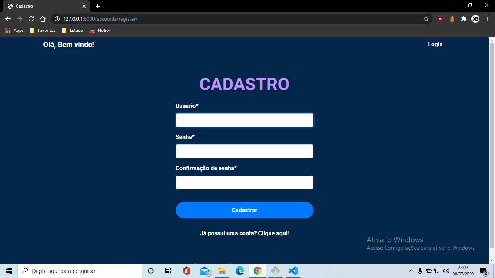
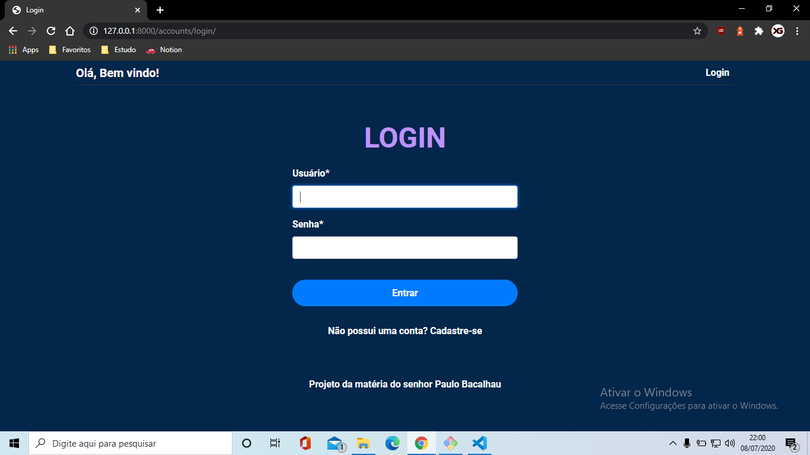
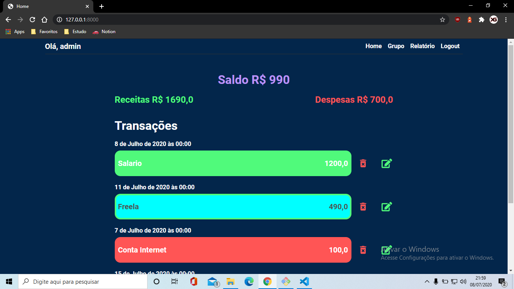
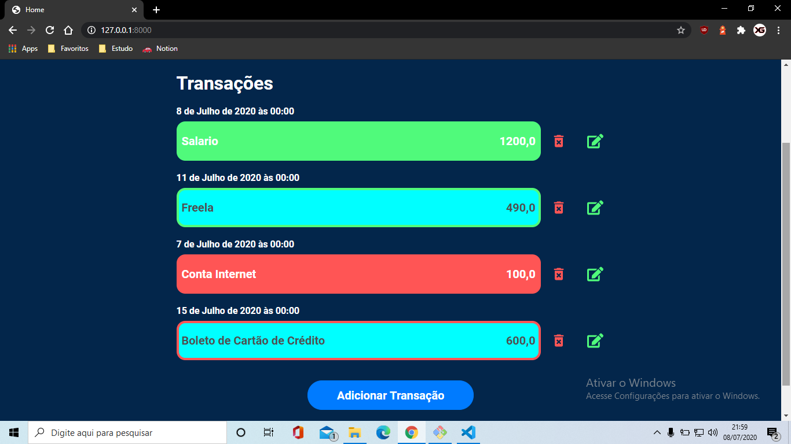
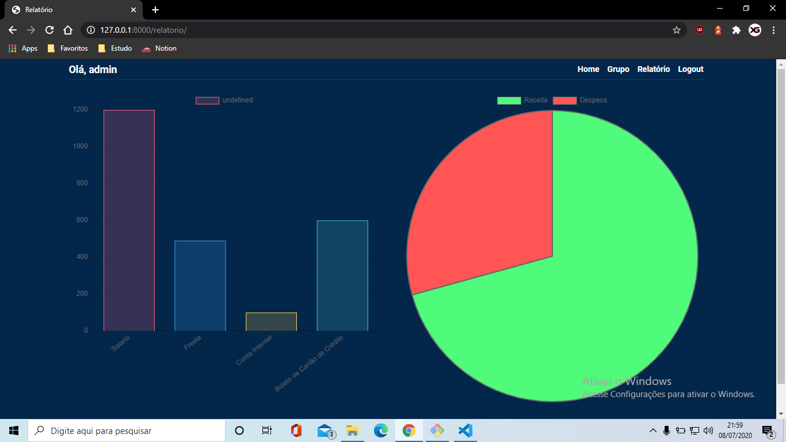

# Aplicação de Finanças com Framework Django

> Status do projeto: em desenvolvimento

## INICIAR O PROJETO
Instalar todos os pacotes necessários do projeto
pip install -r requirements.txt

Rodar o servidor da aplicação
python manage.py runserver
